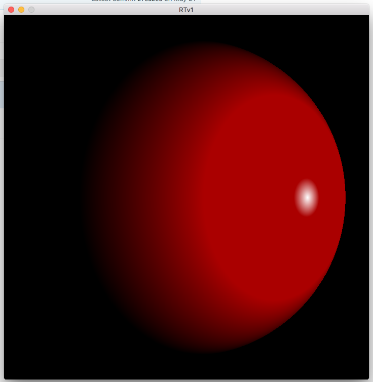
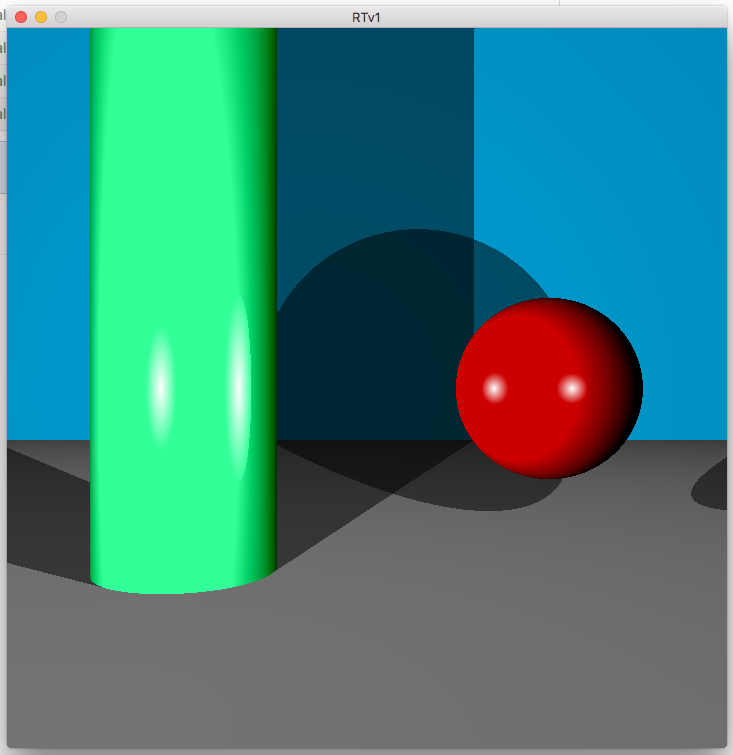
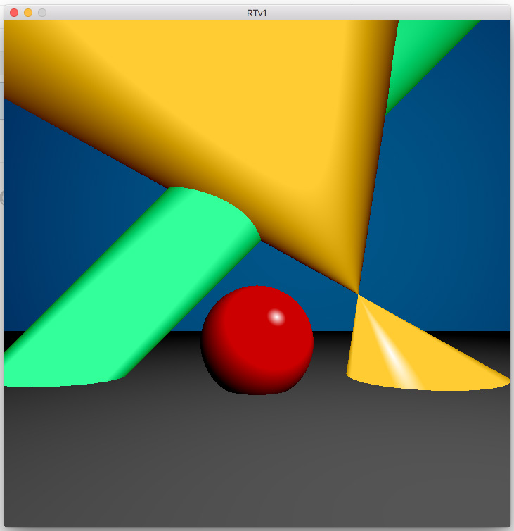

# Ray_Tracer_Implementation
A small ray tracing implementation.

This project is an implementation of a small raytracing engine. Classical programming school project, we had to implement
some basic shapes, that are the sphere, the infinite cylinder, the infinite cone, and the plane. To this goal, we had to
translate the mathematical formulas into code, based on a screen composed of vectors. Each screen pixel is a 
vector of x,y, and z values, and each search for the shapes on the scene with the help of formulas.

